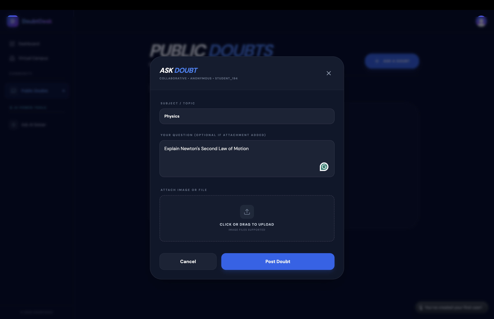
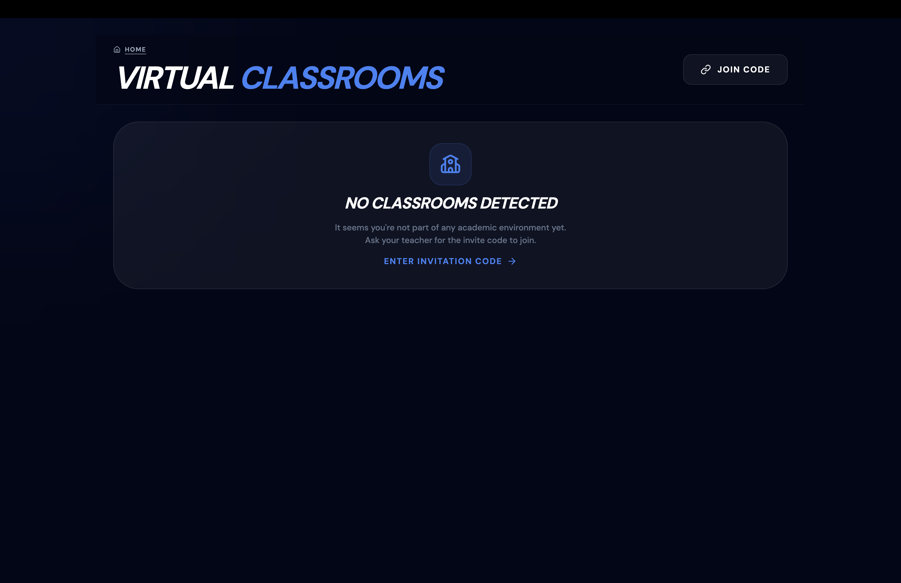
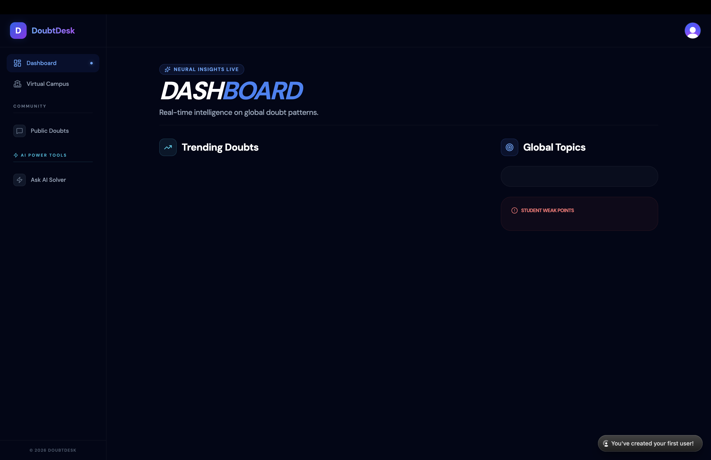

# 🚀 DoubtDesk

**An AI-powered collaborative classroom platform where students get instant doubt resolution, teachers manage virtual classrooms, and analytics drive better learning outcomes.**

[](LICENSE)
[](CONTRIBUTING.md)
[](#)

---

## 🎯 Problem Statement

Students in colleges and universities face a common, frustrating cycle:

- **Doubts go unanswered** — Asking in large classes is intimidating, and teachers aren't available 24/7.
- **No structured Q&A** — WhatsApp groups are chaotic. Doubts get buried. Solutions are never archived.
- **Teachers lack visibility** — They have no data on which topics students are struggling with until exam results come in (too late).
- **Existing platforms miss the mark** — Stack Overflow is for professionals, not structured academics. ChatGPT has no classroom context.

**DoubtDesk bridges this gap** by combining AI-powered instant solving with real classroom structure — giving students answers in seconds and teachers insights in real-time.

---

## 💡 Solution

DoubtDesk provides a **virtual classroom** where:

1. **Students ask doubts** via text or image (photo of a handwritten problem).
2. **AI instantly solves** the doubt with step-by-step, simplified, and exam-ready explanations.
3. **Community & Teachers** can also answer, creating a layered support system.
4. **Analytics dashboard** identifies weak topics, peak doubt hours, and resolution rates — so teachers can act proactively.
5. **Moderation engine** keeps the platform academic and safe using AI content filtering.

---

## ✨ Features

### 🧠 AI Doubt Solver
- Type a question or upload a photo — AI solves it instantly using Groq-accelerated LLMs.
- Structured output: Step-by-step → Simplified → Final Answer.
- Interactive follow-ups: click any step to ask "explain this more."
- Full LaTeX rendering for math and science equations (KaTeX).

### 🏫 Virtual Classrooms
- Teachers create classrooms with unique invite codes.
- Students join using invite codes; recommended classrooms auto-surface by university/year.
- Three doubt channels per class: **AI Solve**, **Community Board**, **Teacher Lane**.
- Role-based views (Student vs Teacher) with distinct capabilities.

### 📊 Classroom Analytics
- **Topic Difficulty Heatmap** — highlights which subjects have the most doubts.
- **Resolution Pulse** — solved vs. pending ratio with circular progress visualization.
- **Peak Activity Timeline** — 24-hour bar chart showing when students are most active.
- **Personal AI Mentor** — per-student weak-topic detection after sufficient engagement.

### 🛡️ Moderation & Safety
- AI-powered content moderation flags abusive, off-topic, or spam content.
- 3-strike system with escalating temporary account blocks.
- Full audit trail via moderation logs table.

### 🌐 Public Doubt Board
- Open community board (no classroom required) with subject filters.
- Like, reply, and mark doubts as solved.

---

## 🧠 How It Works

```
Student signs up → Onboarding (university, year, role)
       ↓
Joins/Creates a Classroom (via invite code)
       ↓
┌──────────────────────────────────────────────┐
│  Ask a Doubt (Text or Image Upload)          │
│       ↓                                      │
│  ┌─────────┬──────────────┬───────────────┐  │
│  │  AI Tab │ Community Tab│ Teacher Tab   │  │
│  │ (Groq)  │ (Peer Reply) │ (Direct Ask)  │  │
│  └─────────┴──────────────┴───────────────┘  │
│       ↓                                      │
│  Resolution + Follow-up Chat                 │
│       ↓                                      │
│  Analytics Dashboard (Insights for all)      │
└──────────────────────────────────────────────┘
```

---

## 🛠️ Tech Stack

| Layer | Technology | Purpose |
| :--- | :--- | :--- |
| **Framework** | Next.js 14 (App Router) | Full-stack React framework |
| **Language** | TypeScript | Type safety |
| **Auth** | Clerk | Authentication & user management |
| **AI Engine** | Groq API (Llama 3.3/4) | Ultra-fast LLM inference |
| **Database** | Neon PostgreSQL | Serverless Postgres |
| **ORM** | Drizzle ORM | Type-safe database queries |
| **Background Jobs** | Inngest | Reliable async workflows |
| **Styling** | Tailwind CSS + shadcn/ui | UI components & design system |
| **Math Rendering** | KaTeX | LaTeX equation rendering |
| **OCR / Vision** | Tesseract.js + Vision LLMs | Image-based doubt input |
| **Notifications** | Sonner | Toast notifications |

---

## 📸 Screenshots

> **Screenshots coming soon!** Want to help? See issue [#1 — Add screenshots to README](#-good-first-issues).


[Landing Page](screenshots/landing.png)





---

## 🚀 Getting Started

### Prerequisites

- **Node.js** 18 or higher
- **npm** (comes with Node.js)
- **Git**
- API keys for: [Clerk](https://clerk.com), [Neon](https://neon.tech), [Groq](https://console.groq.com)

### Installation

```bash
# 1. Fork the repository (click Fork on GitHub)

# 2. Clone your fork
git clone https://github.com/<your-username>/DoubtDesk.git
cd DoubtDesk

# 3. Install dependencies
npm install

# 4. Set up environment variables
cp .env.example .env
# Fill in your API keys (see below)

# 5. Start the development server
npm run dev
```

### Environment Variables

Create a `.env` file in the project root:

```env
# Database (Neon PostgreSQL)
DATABASE_URL=your_neon_connection_string

# Authentication (Clerk)
NEXT_PUBLIC_CLERK_PUBLISHABLE_KEY=pk_test_...
CLERK_SECRET_KEY=sk_test_...
NEXT_PUBLIC_CLERK_SIGN_IN_URL=/sign-in
NEXT_PUBLIC_CLERK_SIGN_UP_URL=/sign-up

# AI (Groq)
GROQ_API_KEY=gsk_...
```

### Run Locally

```bash
npm run dev
# Open http://localhost:3000
```

---

## 🧩 Contributing

We love contributions! Whether you're fixing a typo, adding a feature, or suggesting an improvement — you're welcome here.

Please read our full **[CONTRIBUTING.md](CONTRIBUTING.md)** before submitting a PR.

### Quick Start for Contributors

1. **Find an issue** — Check the [Issues](https://github.com/knoxiboy/DoubtDesk/issues) tab. Look for labels like `good-first-issue` or `beginner-friendly`.
2. **Comment on the issue** — Say "I'd like to work on this" so others know it's taken.
3. **Fork & clone** the repository.
4. **Create a branch** using this naming convention:
   - `feature/add-dark-mode-toggle`
   - `fix/classroom-invite-validation`
   - `docs/update-readme-screenshots`
5. **Make your changes** with clear, focused commits.
6. **Test your changes** locally.
7. **Submit a PR** against the `main` branch.

### Commit Message Format

```
feat: add loading skeleton to AI solver
fix: handle empty classroom state gracefully
docs: add screenshots to README
style: improve mobile responsiveness of classroom cards
refactor: extract doubt card into reusable component
```

### Code Style

- Use TypeScript (no `any` where avoidable).
- Follow the existing component structure in `/components` and `/app`.
- Use Tailwind CSS for styling (match the existing dark theme).
- Keep components focused — one file, one responsibility.

---

## 🟢 Good First Issues

New to open source? Start here! These issues are designed to help you make your first contribution:

- Look for the `good-first-issue` label on the [Issues page](https://github.com/knoxiboy/DoubtDesk/issues).
- Each issue includes clear **steps to solve** and **expected outcome**.
- If you're stuck, comment on the issue — maintainers will help.

**Examples of beginner tasks:**
- Add a screenshot to the README
- Improve an error message
- Add a loading skeleton to a page
- Fix a small UI alignment issue

---

## 🏷️ Issue Labels

| Label | Meaning |
| :--- | :--- |
| `good-first-issue` | Perfect for first-time contributors. Small, well-scoped tasks. |
| `beginner-friendly` | Slightly more involved, but still approachable with some guidance. |
| `bug` | Something is broken and needs fixing. |
| `enhancement` | A new feature or improvement to existing functionality. |
| `documentation` | Improvements to docs, README, or inline comments. |
| `frontend` | Changes to UI components, pages, or styling. |
| `backend` | Changes to API routes, database, or server logic. |
| `ai` | Changes to AI prompts, model handling, or moderation. |

---

## 📂 Project Structure

```
DoubtDesk/
├── app/
│   ├── (auth)/           # Clerk auth pages
│   ├── api/              # API routes (doubts, rooms, analytics, AI)
│   ├── ask-ai/           # Standalone AI solver page
│   ├── dashboard/        # Analytics dashboard
│   ├── onboarding/       # User onboarding flow
│   ├── public-rooms/     # Public doubt board
│   ├── rooms/            # Classroom list & individual classroom
│   ├── layout.tsx        # Root layout (Clerk + Provider)
│   └── page.tsx          # Landing page
├── components/           # Reusable UI components
│   ├── ui/               # shadcn/ui primitives
│   ├── AskAIView.tsx     # AI solver component
│   ├── AskDoubt.tsx      # Doubt submission modal
│   ├── DoubtCard.tsx     # Doubt display card
│   └── Sidebar.tsx       # Navigation sidebar
├── configs/
│   ├── db.tsx            # Database connection
│   └── schema.ts         # Drizzle ORM schema (all tables)
├── lib/
│   ├── moderation.ts     # AI content moderation
│   ├── email.ts          # Warning/block email helpers
│   └── auth-utils.ts     # Auth utility functions
├── inngest/              # Background job definitions
├── scripts/              # Developer utility & database scripts
└── middleware.tsx         # Clerk auth + rate limiting middleware
```

---

## 📜 Code of Conduct

We are committed to providing a welcoming and harassment-free experience for everyone. Please read our [Code of Conduct](CODE_OF_CONDUCT.md) before participating.

**In short:** Be respectful, be constructive, be kind.

---

## 📄 License

This project is licensed under the **MIT License** — see the [LICENSE](LICENSE) file for details.

---

## 🙏 Acknowledgments

- [Groq](https://groq.com) for ultra-fast AI inference
- [Clerk](https://clerk.com) for seamless authentication
- [Neon](https://neon.tech) for serverless PostgreSQL
- [shadcn/ui](https://ui.shadcn.com) for beautiful UI components

---

<p align="center">
  Made with ❤️ for students and teachers everywhere
</p>
